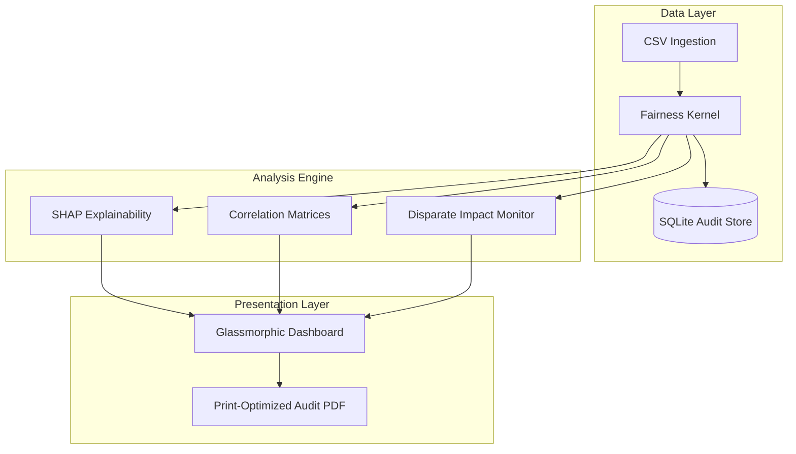

# Aequitas AI — Industrial Fairness Toolkit

A production-grade, full-stack AI fairness auditing platform designed to detect, analyze, and remediate bias in machine learning models and datasets.


---

## 🏛️ System Architecture

Aequitas operates on a **Fairness-Aware Kernel** that bridges the gap between raw data and executive accountability.



---

## 🚀 Key Features

- **Bias Explorer**: Real-time visualization of Disparate Impact (4/5ths Rule) across protected groups (Race, Gender, Age).
- **SHAP Influence**: Understand which features are driving model decisions and identify potential discriminatory variables.
- **Proxy Detection**: Automated detection of latent proxy variables using Cramér's V and Eta-squared statistical correlation.
- **Remediation Playbook**: Simulate threshold adjustments and re-weighting strategies to move the model toward parity.
- **Industrial Reporting**: Export hardened PDF audit manifests suitable for compliance and stakeholder reviews.

---

## 🛠️ Technical Stack

### Backend (Kernel)
- **FastAPI**: High-performance REST API.
- **Pandas / Scikit-learn**: Data processing and model training.
- **SHAP**: Game-theoretic approach to explain model outputs.
- **SQLite**: Local persistence for audit history.

### Frontend (Observability)
- **Next.js 16**: Modern React framework with Turbopack.
- **Framer Motion**: Premium micro-animations and glassmorphic UI.
- **Tailwind CSS**: Utility-first styling with custom print-media hardening.

---

## 📦 Installation & Setup

### 1. Prerequisites
- Python 3.10+
- Node.js 18+
- npm or yarn

### 2. Backend Setup
```bash
cd backend
python -m venv venv
source venv/bin/activate  # Windows: venv\Scripts\activate
pip install -r requirements.txt
python main.py
```

### 3. Frontend Setup
```bash
cd frontend
npm install
npm run dev
```

The application will be available at `http://localhost:3000`.

---

## 🔄 Development Workflow

1.  **Ingest**: Upload your dataset (CSV) via the dashboard.
2.  **Audit**: Initialize the fairness kernel to train the diagnostic model.
3.  **Explore**: Use the SHAP importance and Correlation Matrix to find hidden bias.
4.  **Remediate**: Open the Playbook to test mitigation strategies.
5.  **Report**: Generate the PDF manifest to document findings and remediations.

---

## 🛣️ Roadmap & Missing Artifacts

See [PROJECT_SCAN.md](./PROJECT_SCAN.md) for a detailed technical audit.

- [ ] **Phase 1**: Implement `pytest` for fairness math validation.
- [ ] **Phase 2**: Dockerize the full-stack environment.
- [ ] **Phase 3**: Add JWT Authentication and Role-Based Access Control.
- [ ] **Phase 4**: Integrate Celery for asynchronous large-scale SHAP processing.

---

**Built with ❤️ for AI Accountability.**
