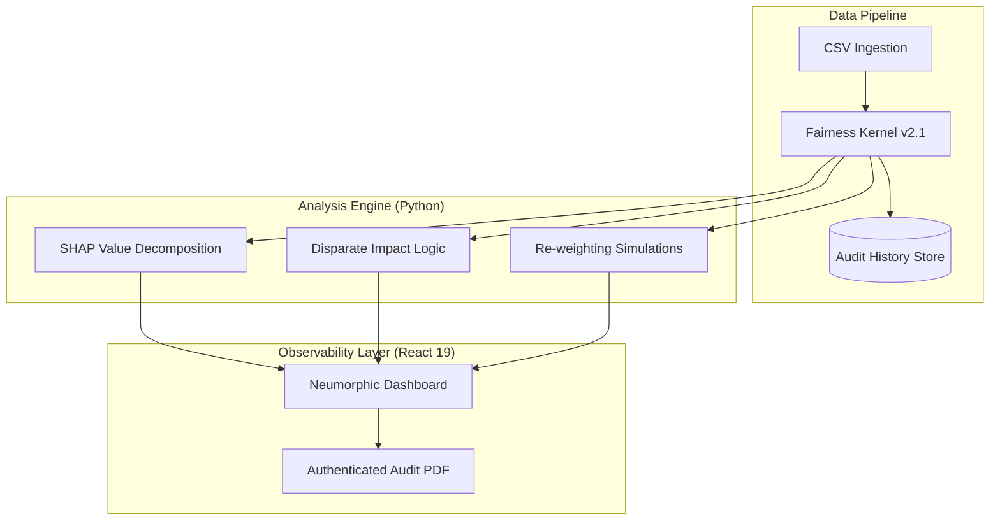

# 🛡️ Aequitas AI — The Industrial Fairness Kernel


[](https://nextjs.org/)
[](https://fastapi.tiangolo.com/)
[](https://shap.readthedocs.io/)
[](https://cloud.google.com/)

**Aequitas AI** is a production-grade, full-stack audit ecosystem designed to solve the "Black Box" problem in modern Machine Learning. We bridge the gap between statistical parity and executive accountability through high-fidelity explainability and automated bias mitigation.

---

## 🚀 Live Production Environment

The system is deployed on **Google Cloud Run** using a hardened, containerized microservices architecture.

- **🌐 Live Dashboard**: [https://aequitas-frontend-687756290895.us-central1.run.app](https://aequitas-frontend-687756290895.us-central1.run.app)
- **⚙️ Backend API**: [https://aequitas-backend-687756290895.us-central1.run.app](https://aequitas-backend-687756290895.us-central1.run.app)

---

## 🧠 The Fairness Engine (Core Intelligence)

Aequitas doesn't just "check" for bias—it computes the **game-theoretic influence** of every feature within your model's decision-making kernel.

### 🔍 Explainable Bias (SHAP)
We utilize **SHAP (SHapley Additive exPlanations)** to decompose model outputs. This allows us to identify if a protected attribute (like Race or Gender) is implicitly driving predictions through latent proxy variables.

### ⚖️ Statistical Parity Kernel
Embedded within our `FairnessEngine` (Python/FastAPI) are real-time compliance monitors:
- **Disparate Impact (4/5ths Rule)**: Automated monitoring of selection rates across demographic groups.
- **Demographic Parity**: Measurement of prediction probability equality.
- **Cramér's V Correlation**: High-precision detection of feature-proxies to prevent "hidden" discrimination.

---

## 🏛️ System Architecture



---

## 🛠️ Developer Setup

### 📦 Prerequisites
- **Python 3.10+** (Linter-hardened)
- **Node.js 20+** (LTS Recommended)
- **Docker** (Optional for containerization)

### 🏗️ Backend Setup
```bash
cd backend
python -m venv venv
source venv/bin/activate  # or venv\Scripts\activate
pip install -r requirements.txt
python main.py
```

### 🎨 Frontend Setup
```bash
cd frontend
npm install
npm run dev
```

---

## 🌌 The Industrial Aesthetic
Our UI is built with a **Physical Design (Neumorphic)** aesthetic. It utilizes glassmorphic layers, CRT scanline effects, and interactive physical buttons to give the auditor a sense of high-stakes precision and manual control.

- **Framer Motion 12**: Smooth, organic micro-interactions.
- **Tailwind CSS 4**: Optimized for native compilation and complex shadows.
- **Print Optics**: Hardened CSS for generating high-fidelity PDF manifests.

---

## 🏁 Roadmap
- [x] **v2.1**: Live Cloud Run Deployment & SHAP Real-time Analysis.
- [ ] **v2.5**: LLM-powered "AI Advisor" for remediation reasoning (Gemini 1.5 Integration).
- [ ] **v3.0**: Federated Learning support for private-dataset auditing.

---

**Created for the Google Solution Challenge 2026.**
*Ensuring that as AI scales, Equity scales with it.*
